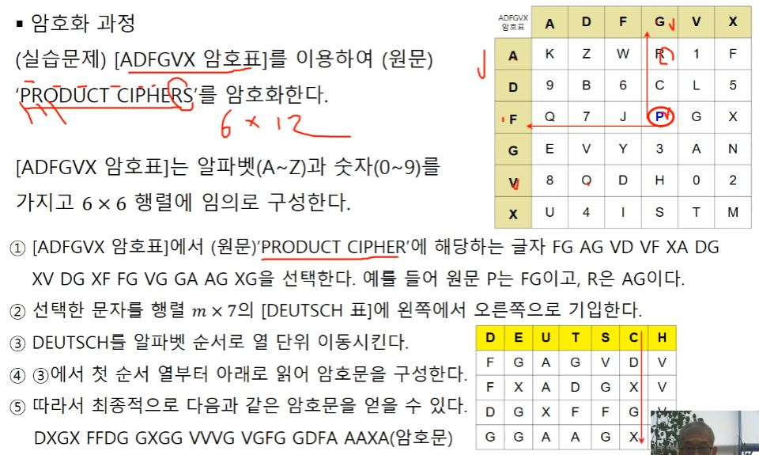

# 오늘 처음 블로그 생성

```java
import java.util.Scanner;

public class HelloWorld {

    public static void main(String[] args) {

        // Creates a reader instance which takes
        // input from standard input - keyboard
        Scanner reader = new Scanner(System.in);
        System.out.print("Enter a number: ");

        // nextInt() reads the next integer from the keyboard
        int number = reader.nextInt();

        // println() prints the following line to the output screen
        System.out.println("You entered: " + number);
    }
}
```

```python
# Python Program to find the area of triangle

a = 5
b = 6
c = 7

# Uncomment below to take inputs from the user
# a = float(input('Enter first side: '))
# b = float(input('Enter second side: '))
# c = float(input('Enter third side: '))

# calculate the semi-perimeter
s = (a + b + c) / 2

# calculate the area
area = (s*(s-a)*(s-b)*(s-c)) ** 0.5
print('The area of the triangle is %0.2f' %area)
```


